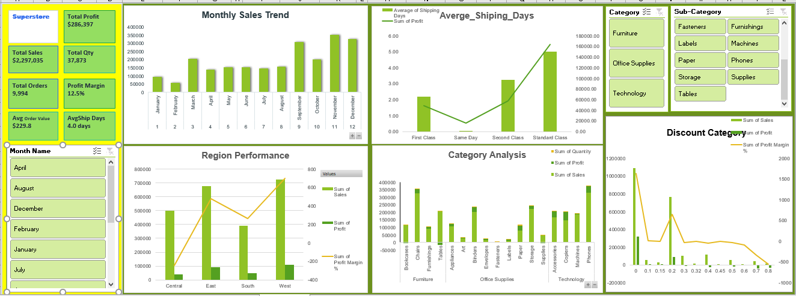

# E-Commerce Sales Dashboard Analysis

## Project Overview
This project analyzes e-commerce sales performance using Microsoft Excel, Power Query, Pivot Tables, and interactive dashboard visualizations. The dashboard focuses on sales trends, profitability, regional performance, customer segments, and discount impact analysis to support business decision-making.

---

## Business Questions
- How much revenue is being generated?
- Which regions contribute the highest sales and profit?
- How do discounts impact profitability?
- Which product categories perform best?
- What are the monthly sales and profit trends?
- Which customer segments contribute the most revenue?

---

## Tools & Technologies Used
- Microsoft Excel
- Power Query
- Pivot Tables
- Pivot Charts
- KPI Analysis
- Dashboard Design

---

## KPIs Tracked
- Total Sales
- Total Profit
- Profit Margin %
- Average Shipping Days
- Quantity Sold
- Total Orders
- Discount Impact %

---

## Dashboard Preview

---

## Key Insights

### 1. Discount Impact on Profitability
Higher discount levels increased sales volume; however, profitability did not increase proportionally, indicating margin pressure due to aggressive discounting strategies.

### 2. Regional Performance
The western region generated the strongest overall sales contribution, while some smaller regions maintained better profit efficiency.

### 3. Seasonal Sales Trends
Sales performance peaked during year-end months, suggesting strong seasonal demand patterns.

### 4. Product Performance
Several high-selling products generated lower profit margins, indicating opportunities for pricing optimization.

### 5. Customer Segment Contribution
Corporate and Consumer segments contributed the largest share of revenue.

---

## What I Learned
- Data cleaning using Power Query
- KPI development and business analysis
- Interactive dashboard design
- Data storytelling and insight generation
- Dashboard visualization best practices
